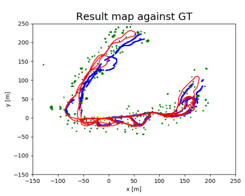

# UFastSLAM
Implementation of Unscented Fast SLAM algorithm for Applied Estimation (EL2320) - KTH
This code is the implementation of the algorithm presented by C. Kim in <a href="https://ieeexplore.ieee.org/document/4569861">"Unscented FastSLAM: a Robust and Efficient Solution to the SLAM Problem"</a><a href="#bib1">[1]</a>. The code is based on the code provided by the <a href="https://github.com/OpenSLAM-org/openslam_ufastslam">author</a>.
<table>
<tbody>
  <tr>
    <td width="50%"></td>
    <td width="50%"></td>
  </tr>
  </tbody>
</table>
      
## How to run the program
The program has to be run with Python 3 interpreter. The main is located in Uslam.py.
```
  usage: USlam.py [-h] [-p [PLOT]] [-s]
  optional arguments:
  -h, --help  show this help message and exit
  -p [PLOT]   plot option. If the value specified is < = 0, then the nothing
              will be plotted, otherwise the number determines the frequency
              of plot updates (lower = higher frequency).
  -s          if specified, saves all the producted plots in the /output
              folder
```


## Algorithm overview
The high level structure of the algorithm is the following:
``` python
1. while control data is available:
2.     for each particle in the particle set:
3.         predict motion ACFRU using unscented filter
4.         take measurements
5.         for each measurement:
6.             associate measurement to nearest neighbour
7.             if not associated and far enough from nearest neighbour:
8.                 create new feature
9.             else:
10.                discard measurement
11.        Kalman update vehicle state
12.        Kalman update feature state
13.    resample particles
```
## The dataset
To assess the algorithm, we used the same dataset used by Kim, the Victoria park dataset, recorded by the ACFR University of Sidney <a href="bib2">[2]</a>. The context is a car traveling on a 4km path in the Victoria park. The car is aided with a wheel encoder in the back-left wheel, which provides the control data (current speed and steering). The car uses a laser sensor to detect obstacles on its path, the trees, which can be assimilated to point features; each measurement is a distance d and an angle beta. The dataset provides the car model (figure 1) with the associated probabilistic motion function based on the Ackerman Model. Odometry data is encoded every 0.025s.
GPS data was recorded and is used as ground truth (figure 2).
<table>
  <tbody>
    <tr>
      <td width="50%"></td>
      <td width="50%"></td>
    </tr>
    <tr>
      <td>Figure 1 - Car model provided by the ACFR University of Sidney.</td>
      <td>Figure 2 - Available GPS data.</td>
    </tr>
  </tbody>
  </table>

## Vehicle state prediction
Refers to line 3 of the pseudocode. Implemented in Particle.predictACFRu(self, ctrl)
The vehicle state is predicted according to the motion model provided by <a href="http://www-personal.acfr.usyd.edu.au/nebot/experimental_data/modeling_info/Ute_modeling_info.htm">ACFR University of Sydney</a><a href="#bib3">[3]</a>, which actually created the Victoria Park Dataset.
The state belief is propagated by using the unscented filter applied to an "augmented state", which comprises the vehicle state and the control noise: in this way is possible to draw the sigma points from an higher dimensional multinomial gaussian, thus directly propagating also the uncertainty due to the control (see eq 3-6 in the paper). 
<table>
  <tbody>
    <tr>
      <td></td>
      <td></td>
    </tr>
    <tr>
      <td>Figure 3 – The state of the car is modelled with its mean (red square) and covariance, the dashed pink line represents its 95% confidence interval. Known features are represented in black with the same symbology.</td>
      <td>Figure 4 – We draw a set of sigma points from the vehicle state (red diamonds), each of this corresponds to a specific instance of control noise. Each sigma point is assigned a weight which decreases as the point gets farther from the mean.</td>
    </tr>
    <tr>
      <td></td>
      <td></td>
    </tr>
    <tr>
      <td>Figure 5 – The non-linear motion model is applied to each state point using the corresponding control previously drawn. This
produces a set of transformed sigma points (cyan diamonds). The dotted lines represent the path that is point is predicted to follow.</td>
      <td>Figure 6 – The propagated mean and covariance are retrieved from the transformed sigma points. The state covariance
increases, as it has incorporated the control noise. The blue square is the predicted mean, while the blue dashed line is the prediction covariance.</td>
    </tr>
  </tbody>
</table>

## Measurements
Refers to line 4-12 in the pseudocode.
Measurements are associated with the nearest neighbor as illustrated in <a href="#bib3">[3]</a>. This process is quite intuitive yet expensive: every one of the N measurement is compared with every known landmark (M), thus leading to a O(N\*M) complexity. This is the bottleneck of the algorithm, which could be improved by using a tree-structure to save the landmarks, which would lead to a reduction of the algorithm complexity to O(M\*log(N)).
A crucial parameter that has to be set in this phase, is the "dissimilarity" threshold that a measurement has to reach, in order to create a new feature. Putting this threshold two low may lead to erroneously see odd/noisy measurements as new features, while putting it too low leads to not being able to distinguish between closed features. An example of two different setting for this parameter can be seen in figures 7 and 8.
<table>
  <tbody>
  <tr>
    <td width="50%"></td>
    <td width="50%"></td>
  </tr>    
  <tr>
    <td>Figure 7 – A partial run of the algorithm when the threshold to create new features is a low value. The algorithm creates many features with high uncertainty</td>
    <td>Figure 8 – A partial run of the algorithm when the threshold to create new features is higher. The algorithm is very conservative in creating new features.</td>
  </tr> 
  <tr>
    <td width="50%"></td>
    <td width="50%"></td>
  </tr>    
  <tr>
    <td>Figure 9 – Get measurements. The car sees four obstacles (in green).</td>
    <td>Figure 10 - Data association. Three measurements are associated with known features, while one (green) is not associated with any</td>
  </tr> 
  </tbody>
  </table>

## Kalman updates
Line 13-14 of the pseudocode.
Once we have associated the measurement to the features, it is possible to proceed to the Kalman update of the state, in order to correct it to better fit the current measurement. To this aim the algorithm proposed in the paper applies again the Unscented filter (for the non-linear observation function) to an augmented states which comprises both the vehicle state and the feature state. By doing so it ispossible to propagate at the same time both uncertainties. The process is illustrated in figures 11-15.  
A similar process is followed for the Kalman update of the features state (figure 16).
It is then possible to compute particles weights (eq 14); resampling is done according to the well-known systematic resampling as illustrated in Thrun's Probabilistic Robotics book.
<table>
  <tbody>
    <tr>
      <td width="50%"></td>
      <td width="50%"></td>
    </tr>
    <tr>
      <td>Figure 11 – Set of sigma points drawn from the augmented state. Each point in the vehicle state corresponds to a point in the
feature state. Most points overlap in the mean of both the vehicle and the feature.</td>
      <td>Figure 12 – Example of measurement taken from 3 different sigma points. The width of the laser beam represents the weight of these sigma points.</td>
    </tr>
    <tr>
      <td></td>
      <td></td>
    </tr>
    <tr>
      <td>Figure 13 – Kalman update of the state of the vehicle. As the measurement was seen farther in the x axis than the estimated position of the landmark, the predicted state of the vehicle is moved behind to be more consistent with the measurements.</td>
      <td>Figure 14 – Kalman update of the state of the vehicle. In this case the feature covariance is higher than in Figure 13, hence the sigma points would be more wide-spread in the feature state, causing the innovation covariance to increase. This leads to a smaller reduction of the vehicle state covariance.</td>
    </tr>
    <tr>
      <td></td>
      <td></td>
    </tr>
    <tr>
      <td>Figure 15 As the state of the vehicle is updated, the measurements are more consistent with the features than before (compare with Figure 10).</td>
      <td>Figure 16 – Features that were associated with some measurement are updated. Their covariance is reduced.</td>
    </tr>
  </tbody>
  </table>
  
## Results
### Changing the number of particles
In the following figures (Figure 17, Figure 18, Figure 19) we can observe the results obtained when using a different number of particles. In Table 2 Estimation error when using 1, 2, 5 and 10 particles.Table 1 we summarize the errors in estimation that were obtained in the different cases. The timings refer to a complete run of the algorithm while not producing any plot, on an Intel core i7 8th generation, with a maximum clock speed of 4GHz. The maximum amount of RAM used is 200 MB. The best results were obtained when using 5 particles. The estimated path is consistent with GPS data, and the mean error is about 3.53 meters, however we also have to consider that GPS data has an instrinsic uncertainty as well, hence is not easy to assess the error numerically.
<table>
  <tbody>
  <tr>
    <td width="33%"></td>
    <td width="33%"></td>
    <td width="33%"></td>
  </tr>
    <tr>
      <td>Figure 17 - Result obtained when using only one particle.</td>
      <td>Figure 18 - Result obtained when using 5 particles.</td>
      <td>Figure 19 - Result obtained when using 10 particles.</td>
    </tr>
  </tbody>
  </table>
  <table>
  <thead>
    <tr>
      <th width="25%">Number of particles</th>
      <th width="25%">Mean error [m]</th>
      <th width="25%">Error std dev [m]</th>
      <th width="25%">Time [min]</th>
    </tr>
  </thead>
  <tbody>
    <tr>
      <td>1</td>
      <td>14.48</td>
      <td>14.60</td>
      <td>2.17</td>
    </tr>
    <tr>
      <td>2</td>
      <td>10.68</td>
      <td>8.86</td>
      <td>4.41</td>
    </tr>
    <tr>
      <td>5</td>
      <td>3.53</td>
      <td>2.79</td>
      <td>15.22</td>
    </tr>
    <tr>
      <td>10</td>
      <td>5.01</td>
      <td>6.11</td>
      <td>26.13</td>
    </tr>
  </tbody>
  </table>
  <center>Table 1 - Estimation error when using 1, 2, 5 and 10 particles</center>
  
We observed a certain variance in the results from running the algorithm with 5 particles (figure 20). At the same time increasing the number of particles did not help improving the estimation error. This highlights that the algorithm is not robust enough, and is not able to recover to unlucky resampling of the vehicle state or wrong predictions. This suggests that the estimation process could be helped by integrating GPS data as well, or finding a better tuning for the various paramters, especially for the threshold to create new features. 

<table>
<tbody>
  <tr>
    <td></td>
  </tr>
  <tr>
    <td>Figure 20 - Another run using 5 particles.</td>
  </tr>
  </tbody>
</table>

## Possible improvements
<ul>
  <li>Save the features in a tree-structure, to make the computational time lower.</li>
  <li>Integrate the program with some other module to allow multithreading, since it exposes a lot of parallel computation (the whole computation done for each particle is indipendent one of the other).</li>
</ul>

## References
  <a id="bib1">[1]<b> C. Kim, R. Sakthivel and W. K. Chung. </b> Unscented FastSLAM: A Robust and Efficient Solution to the
    SLAM Problem. <i>IEEE Transactions on Robotics.</i> 2008, Vol. 24, 4, pp. 808-820.<br>
  <a id="bib2">[2]<b>Sydney, ACFR - The University of.</b> <i> Victoria Park dataset.</i><br>
  <a id="bib3">[3]<b>Sebastian Thrun, Wolfram Burgard and Dieter Fox. </b> EKF SLAM with Unknown Correspondences. <i>Probabilistic Robotics. </i> 10.3, p. 323.<br>
 

## Acknowledgments
Based on the code provided by <a href="https://github.com/OpenSLAM-org/openslam_ufastslam">Kim to Open SLAM community</a>
